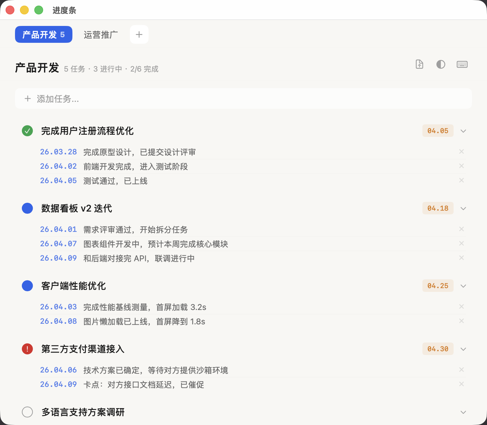
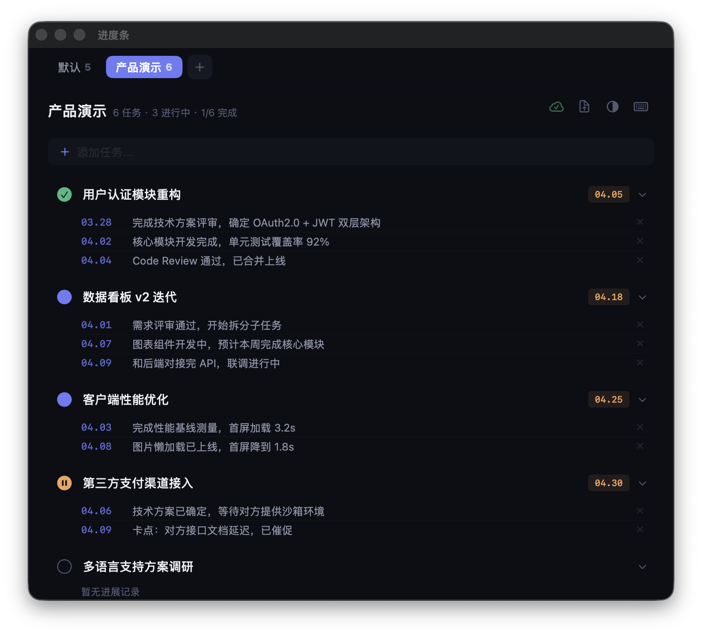
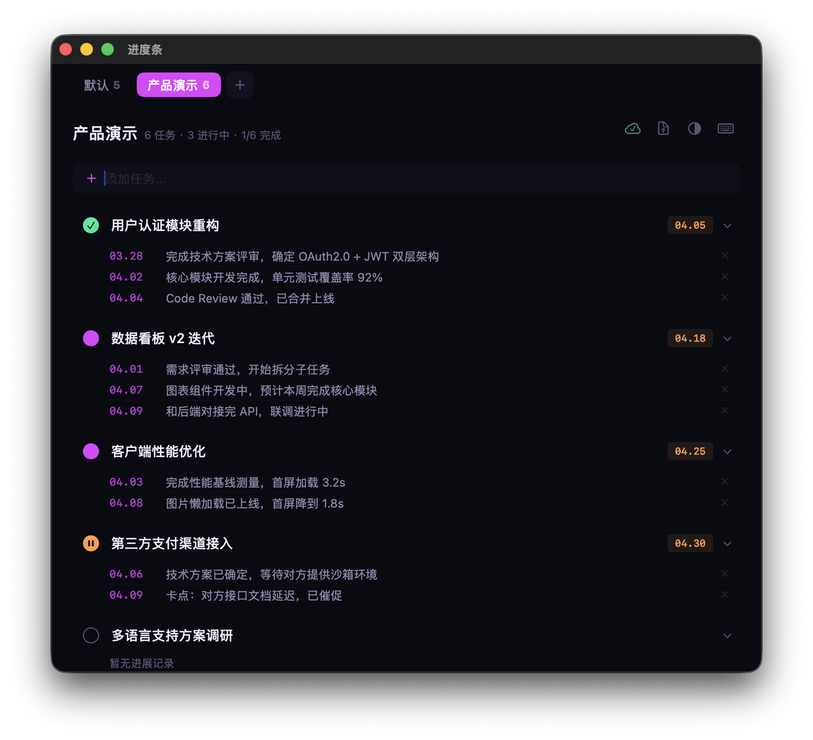

<div align="center">

[English](README_en.md) | 简体中文

<h1>

进度条
</h1>

**轻量、优雅的 macOS 原生任务管理应用**

专注项目进度跟踪与跟进记录 · 纯 SwiftUI · 无需 Xcode · 命令行一键编译

[](LICENSE)
[](https://github.com/notwin/ProgressBar)
[](https://swift.org)
[](https://github.com/notwin/ProgressBar/releases/latest)

<br>



<br>

<details>
<summary><b>更多截图</b></summary>
<br>
<p><b>黑曜石主题</b></p>

<br><br>
<p><b>霓虹主题</b></p>

</details>

<br>

[**下载**](https://github.com/notwin/ProgressBar/releases/latest) ·
[**功能特性**](#功能特性) ·
[**快速开始**](#快速开始) ·
[**参与贡献**](CONTRIBUTING.md)

</div>

<br>

## 功能特性

<table>
<tr>
<td width="50%">

**任务管理**
- 多分区管理，按项目组织任务
- 状态流转：待开始 → 进行中 → 已阻塞 → 已完成
- 拖拽排序，截止日期过期自动高亮
- 完成与归档分离，归档可恢复

</td>
<td width="50%">

**跟进记录**
- 为每个任务添加进展日志
- 默认显示最新 3 条，点击展开全部
- 输入「阻塞」等关键词自动标记状态
- 日期可编辑，按日期自动排序

</td>
</tr>
<tr>
<td>

**日历 & 导出**
- 一键同步截止日期到系统日历
- 创建专属紫色日历，修改/删除自动同步
- 复制为纯文本 / 导出桌面版&手机版 PNG

</td>
<td>

**体验**
- 7 套差异化主题（支持跟随系统深浅色）
- iCloud 多设备同步 + 本地自动备份
- 全套键盘快捷键，⌘1~9 快速切换分区
- 应用内自动更新，启动时静默检查新版本
- MCP 协议集成，AI 助手可直接管理任务

</td>
</tr>
</table>

### 主题一览

| 自动 | 黑曜石 | 深渊 | 砂岩 | 霓虹 | 霜冻 | 纸墨 |
|:---:|:---:|:---:|:---:|:---:|:---:|:---:|
| 跟随系统 | Linear 风 | Arc 风 | 大地暖调 | 赛博朋克 | Nord 风 | Things 3 风 |

### 快捷键

| 操作 | 快捷键 | 操作 | 快捷键 |
|------|:------:|------|:------:|
| 新建任务 | `⌘N` | 复制到剪贴板 | `⇧⌘C` |
| 搜索任务 | `⌘F` | 导出图片 | `⌘E` |
| 同步日历 | `⇧⌘S` | 快捷键一览 | `⌘/` |
| 设置 | `⌘,` | 切换分区 | `⌘1`~`⌘9` |

<br>

## 快速开始

### 下载安装

前往 [**Releases**](https://github.com/notwin/ProgressBar/releases/latest) 下载最新版，解压后将「进度条.app」拖入 Applications 文件夹。

### 从源码编译

```bash
git clone https://github.com/notwin/ProgressBar.git
cd ProgressBar
./Scripts/build.sh    # 编译 → 签名 → 部署 → 启动
```

> **要求** macOS 14.0+，Xcode Command Line Tools（提供 Swift 6 编译器）

<br>

## MCP 集成

进度条提供 [MCP Server](mcp-server/)，支持 AI 助手通过 MCP 协议直接管理任务。

```bash
cd mcp-server && npm install && npx tsc
```

支持的操作：查看分区、列出任务、新建任务、更新状态、添加跟进记录、归档、删除等。

<br>

## 技术栈

| | |
|---|---|
| **语言** | Swift 6 |
| **UI 框架** | SwiftUI + AppKit |
| **日历** | EventKit |
| **构建** | `swiftc` 命令行直接编译，无需 Xcode 工程 |
| **数据** | JSON + iCloud Drive 同步 |
| **国际化** | 13 种语言（中/英/日/韩/法/德/意/西/葡/印地/印尼） |
| **CI/CD** | GitHub Actions 自动编译发布 |
| **最低系统** | macOS 14.0 Sonoma |

<br>

## 项目结构

```
ProgressBar/
├── Sources/
│   ├── App/                  # 应用入口
│   ├── Models/               # 数据模型 · 主题配色
│   ├── Views/                # SwiftUI 视图
│   ├── Services/             # 状态管理 · 持久化 · 日历 · 更新
│   └── Localization/         # 多语言资源（13 种语言）
├── AppBundle/                # Info.plist · 应用图标
├── Scripts/                  # 编译部署 · 发版脚本
├── .github/workflows/        # CI 自动编译发布
└── mcp-server/               # MCP Server
```

## 参与贡献

欢迎提交 Issue 和 Pull Request！详见 [Contributing Guide](CONTRIBUTING.md)。

## 许可证

[MIT](LICENSE) © notwin
